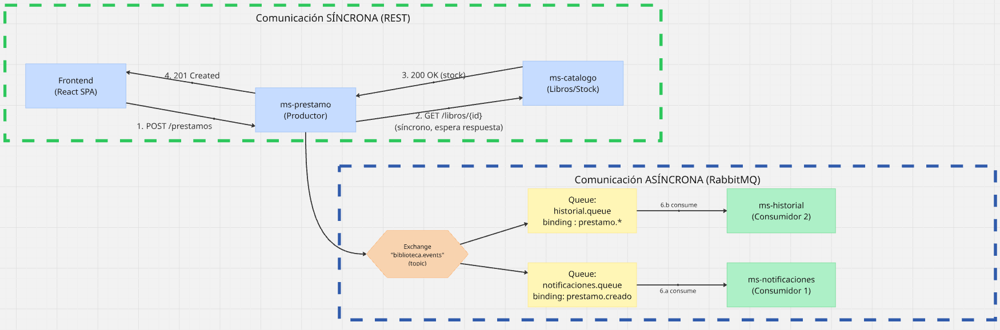

# Sistema Biblioteca — Diseño de Comunicación con RabbitMQ

**Actividad evaluada — Parte 1: Diseño (10% EV2)**
DSY1107 — Desarrollo Cloud Native I · Duoc UC

---

## 1. Contexto del problema

El sistema Biblioteca gestiona el préstamo de libros (dominio Libro–Préstamo). Hasta ahora, toda la comunicación del backend ha sido síncrona vía REST: el frontend llama al backend y espera la respuesta en cada operación. Esta actividad extiende la arquitectura a microservicios, separando responsabilidades e incorporando comunicación asíncrona mediante RabbitMQ para las operaciones que no necesitan bloquear al usuario mientras se procesan.

El caso de uso central es la creación de un préstamo: el sistema debe (a) verificar en el momento si el libro existe y tiene stock disponible —esto sí bloquea la respuesta al usuario, porque de eso depende si el préstamo se acepta— y (b) una vez aceptado el préstamo, disparar efectos secundarios (notificar al usuario, registrar el evento para historial/estadísticas) que no necesitan ocurrir antes de responder al usuario.

## 2. Microservicios involucrados

| Microservicio | Rol | Responsabilidad |
|---|---|---|
| `ms-catalogo` | Proveedor síncrono | Mantiene el catálogo de libros y su stock disponible. Expone un endpoint REST consultado en tiempo real. |
| `ms-prestamo` | Productor | Orquesta la creación/devolución de préstamos. Consulta a `ms-catalogo` de forma síncrona y publica eventos a RabbitMQ. |
| `ms-notificaciones` | Consumidor 1 | Simula el envío de una notificación (correo/push) al usuario cuando se crea o se devuelve un préstamo. |
| `ms-historial` | Consumidor 2 | Registra cada evento de préstamo en un historial/auditoría para estadísticas de uso de la biblioteca. |

## 3. Descripción de los flujos

### 3.1 Flujo síncrono — Verificación de stock

Cuando un usuario solicita un préstamo, `ms-prestamo` necesita saber de inmediato si el libro existe y tiene stock, porque esa respuesta determina si el préstamo se crea o se rechaza en el acto. No se puede "avisar después" — el usuario necesita un `201 Created` o un error en la misma respuesta HTTP. Por eso esta llamada es una petición REST síncrona y bloqueante entre `ms-prestamo` y `ms-catalogo`.

### 3.2 Flujo asíncrono #1 — Notificación al usuario

Una vez que el préstamo ya fue aceptado y guardado, notificar al usuario (por ejemplo, un correo de confirmación) no necesita ocurrir antes de responder. El usuario no debe esperar a que el correo se envíe para recibir la confirmación del préstamo. Por eso `ms-prestamo` publica un evento `prestamo.creado` y responde de inmediato al frontend; `ms-notificaciones` procesa el envío en paralelo, de forma desacoplada.

### 3.3 Flujo asíncrono #2 — Historial y estadísticas

Cada préstamo o devolución también debe quedar registrado para estadísticas (libros más prestados, historial por usuario). Esto tampoco es información que el usuario necesite de vuelta en el momento, y además es deseable que un eventual fallo o lentitud de `ms-historial` no afecte la respuesta al usuario. Por eso `ms-historial` consume los mismos eventos (`prestamo.creado` y `prestamo.devuelto`) de forma independiente, en su propia cola.

## 4. Justificación síncrono vs. asíncrono

| Comunicación | ¿Por qué este tipo? |
|---|---|
| `ms-prestamo` → `ms-catalogo` (síncrona) | La decisión de aceptar el préstamo depende del resultado inmediato (stock disponible sí/no). Es una dependencia dura y de corta duración: justifica bloquear la respuesta. |
| `ms-prestamo` → `ms-notificaciones` (asíncrona) | Es un efecto secundario ("fire and forget" desde el punto de vista del usuario). No debe bloquear ni puede fallar la operación principal si el envío de notificación falla o demora. |
| `ms-prestamo` → `ms-historial` (asíncrona) | Es un efecto secundario de auditoría/analítica, desacoplado del flujo principal. Permite que historial se caiga o esté lento sin afectar la experiencia del usuario ni la disponibilidad del préstamo. |

## 5. Diagrama de arquitectura



El rectángulo punteado azul agrupa la comunicación síncrona (REST, línea continua = petición, línea segmentada = respuesta). El rectángulo punteado dorado agrupa la comunicación asíncrona vía RabbitMQ: el productor publica al exchange, que enruta el mensaje a las colas según la routing key, y cada cola es consumida de forma independiente.

## 6. Eventos de RabbitMQ

| Evento (routing key) | Lo dispara | Quién lo consume |
|---|---|---|
| `prestamo.creado` | Se crea un préstamo exitosamente (tras validar stock) | `ms-notificaciones` y `ms-historial` |
| `prestamo.devuelto` | Se registra la devolución de un libro | `ms-historial` (`ms-notificaciones` opcionalmente, para confirmar devolución) |

## 7. Mapeo productor / consumidor

| Rol | Microservicio | Exchange / Cola | Routing key (binding) |
|---|---|---|---|
| Productor | `ms-prestamo` | Exchange: `biblioteca.events` (topic) | Publica con `prestamo.creado` / `prestamo.devuelto` |
| Consumidor 1 | `ms-notificaciones` | Cola: `notificaciones.queue` | Binding: `prestamo.creado` |
| Consumidor 2 | `ms-historial` | Cola: `historial.queue` | Binding: `prestamo.*` (coincide con `prestamo.creado` y `prestamo.devuelto`) |

## 8. Configuración de exchange, colas y routing

### 8.1 Exchange

- **Nombre**: `biblioteca.events`
- **Tipo**: `topic` — permite enrutar por patrón (`prestamo.*`), no solo por nombre exacto, dejando la puerta abierta a nuevos eventos (ej. `libro.agotado`) sin reconfigurar consumidores existentes.
- **Durable**: sí (sobrevive a un reinicio del broker).

### 8.2 Colas

- `notificaciones.queue` — durable, binding con routing key `prestamo.creado`.
- `historial.queue` — durable, binding con routing key `prestamo.*` (patrón, cubre creado y devuelto).

### 8.3 Bindings (resumen)

```
biblioteca.events --(prestamo.creado)--> notificaciones.queue
biblioteca.events --(prestamo.*)------> historial.queue
```

## 9. Payloads de los mensajes

### 9.1 Evento `prestamo.creado`

```json
{
  "eventId": "a3f1c2e0-7b4d-4a1e-9c3f-1234567890ab",
  "tipo": "prestamo.creado",
  "prestamoId": 101,
  "libroId": 5,
  "usuario": "usuario1@tenant.onmicrosoft.com",
  "fechaPrestamo": "2026-10-02T15:30:00Z",
  "fechaDevolucionEstimada": "2026-10-16T15:30:00Z",
  "estado": "ACTIVO"
}
```

### 9.2 Evento `prestamo.devuelto`

```json
{
  "eventId": "b7d4e1f2-9c3a-4e2d-8f1b-0987654321cd",
  "tipo": "prestamo.devuelto",
  "prestamoId": 101,
  "libroId": 5,
  "usuario": "usuario1@tenant.onmicrosoft.com",
  "fechaDevolucionReal": "2026-10-10T12:00:00Z",
  "estado": "DEVUELTO"
}
```

## 10. Resumen de cumplimiento de requisitos mínimos

| Requisito mínimo de la actividad | Cómo se cumple |
|---|---|
| Al menos 1 comunicación síncrona | `ms-prestamo` → `ms-catalogo` (REST, verificación de stock) |
| 2 o más comunicaciones asíncronas | `prestamo.creado` y `prestamo.devuelto`, vía RabbitMQ |
| 1 productor y 1 exchange | `ms-prestamo` produce hacia `biblioteca.events` (topic) |
| Colas que representan los flujos | `notificaciones.queue` e `historial.queue` |
| Al menos 2 consumidores distintos | `ms-notificaciones` y `ms-historial` |
| Routing keys y bindings coherentes | `prestamo.creado` / `prestamo.*` mapeados según quién necesita cada evento |

---

## Anexo — Próximos pasos (Parte 2, 5 de octubre)

- Implementar `ms-notificaciones` y `ms-historial` como servicios Spring Boot con `spring-boot-starter-amqp`.
- Configurar RabbitMQ (local con Docker o CloudAMQP) con el exchange y las colas descritas.
- Implementar el productor en `ms-prestamo` (`RabbitTemplate.convertAndSend`).
- Implementar los consumidores (`@RabbitListener`) en `ms-notificaciones` y `ms-historial`.
- Capturar evidencia en la consola de administración de RabbitMQ: exchange, colas, bindings y mensajes procesados.
